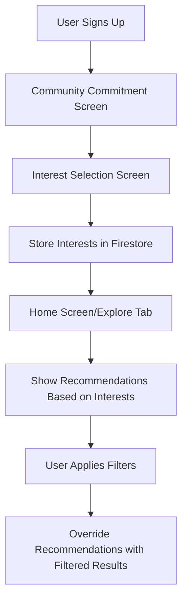
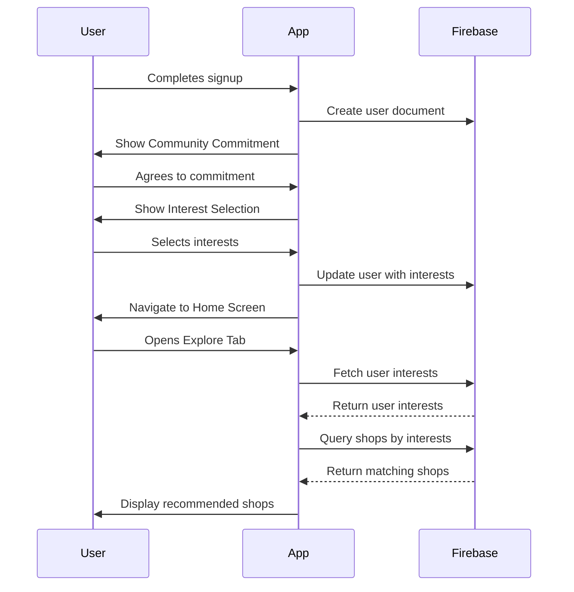

# Interest Selection Feature Design

## 1. Overview

This document outlines the design for adding an interest selection screen to the authentication flow of the Cofi application. After users sign up, they will be presented with a screen where they can select their interests from a list of cafe-related options. These interests will be stored in Firebase Firestore and used to provide personalized recommendations in the Explore tab.

The feature includes:
- A new interest selection screen after signup
- Chip-based UI for selecting multiple interests
- Storage of user interests in Firebase Firestore
- Personalized recommendations in the Explore tab based on user interests
- Filtering functionality that overrides recommendations when applied

### 1.1 Goals
- Improve user onboarding experience by collecting interest preferences
- Provide personalized cafe recommendations in the Explore tab
- Maintain existing filtering functionality while integrating interest-based recommendations
- Ensure seamless integration with existing authentication flow

## 2. Architecture

### 2.1 Component Structure

The implementation will involve the following components:

1. **InterestSelectionScreen** - New screen for users to select their interests
2. **Authentication Flow Modification** - Integration of the new screen into the signup flow
3. **User Data Enhancement** - Storing interests in the user document
4. **ExploreTab Enhancement** - Using interests for recommendations
5. **Filtering Logic** - Implementing filter chips in ExploreTab that override recommendations

### 2.2 Data Flow



### 2.3 Firebase Data Structure

The user interests will be stored in the existing user document in the `users` collection:

```
users/{userId}
├── firstName: string
├── lastName: string
├── email: string
├── interests: array[string]  // New field
├── bookmarks: array[string]
├── visited: array[string]
├── reviews: array[string]
└── ...
```

### 2.4 File Structure

New files to be created:
- `lib/screens/auth/interest_selection_screen.dart`

Files to be modified:
- `lib/screens/auth/community_commitment_screen.dart` (navigation flow)
- `lib/screens/tabs/explore_tab.dart` (recommendation logic)
- `lib/screens/auth/signup_screen.dart` (user document creation)

### 2.5 Dependencies

No new dependencies are required as all components used are part of the existing Flutter and Firebase SDKs:
- Flutter Material Library (FilterChip, ElevatedButton)
- Firebase Firestore (data storage and retrieval)
- Firebase Auth (user identification)

## 3. UI/UX Design

### 3.1 Interest Selection Screen

The new screen will be inserted into the authentication flow after the Community Commitment screen and before the Home screen.

#### Key Features:
- Title: "What are you interested in?"
- Subtitle: "Select all that apply"
- Chip-based selection interface with the following options:
  - 'Specialty Coffee'
  - 'Matcha Drinks'
  - 'Pastries'
  - 'Work-Friendly (Wi-Fi + outlets)'
  - 'Pet-Friendly'
  - 'Parking Available'
  - 'Family Friendly'
  - 'Study Sessions'
  - 'Night Café (Open Late)'
  - 'Minimalist / Modern'
  - 'Rustic / Cozy'
  - 'Outdoor / Garden'
  - 'Seaside / Scenic'
  - 'Artsy / Aesthetic'
  - 'Instagrammable'
- "Continue" button to proceed to the main app

#### UI Specifications:
- Use FilterChip widgets for the interest selection
- Selected chips will have a different color to indicate selection
- Users can select multiple interests
- Validation to ensure at least one interest is selected

#### UI Mockup:
```
+--------------------------------------------------+
|  ←  What are you interested in?               X  |
|                                                  |
|  Select all that apply                           |
|                                                  |
|  [Specialty Coffee]  [Matcha Drinks]  [Pastries] |
|  [Work-Friendly]     [Pet-Friendly]   [Parking]  |
|  [Family Friendly]   [Study Sessions] [Night...] |
|  [Minimalist]        [Rustic/Cozy]    [Outdoor]  |
|  [Seaside/Scenic]    [Artsy/Aesthetic][Instagram]|
|                                                  |
|  [Continue]                                      |
+--------------------------------------------------+
```

#### UI Component Specifications:

1. **AppBar**
   - Title: "What are you interested in?"
   - Back button: Navigator.pop(context)
   - Background: Colors.black

2. **Body**
   - Background: Colors.black
   - Padding: EdgeInsets.symmetric(horizontal: 20, vertical: 10)

3. **Filter Chips**
   - Widget: FilterChip
   - Background color: unselected = Color(0xFF222222), selected = primary color
   - Shape: RoundedRectangleBorder(borderRadius: BorderRadius.circular(20))
   - Label style: TextStyle(color: Colors.white)
   - Checkmark color: Colors.white
   - Elevation: 0

4. **Continue Button**
   - Widget: ElevatedButton
   - Text: "Continue"
   - Background color: primary color (red)
   - Text color: Colors.white
   - Shape: RoundedRectangleBorder(borderRadius: BorderRadius.circular(28))
   - Padding: EdgeInsets.symmetric(vertical: 16)
   - Full width button

### 3.2 Explore Tab Enhancements

The Explore tab will be modified to show recommendations based on user interests by default.

#### Key Features:
- Recommendations based on user interests stored in Firestore
- Filter chips with no initial selection (allowing recommendations to show)
- When user selects filters, recommendations are overridden with filtered results

## 4. Implementation Details

### 4.1 Interest Selection Screen Implementation

1. **Create InterestSelectionScreen widget**
   - State management for selected interests
   - Chip display and selection logic
   - Continue button with validation

2. **Modify Authentication Flow**
   - Update CommunityCommitmentScreen to navigate to InterestSelectionScreen
   - Update InterestSelectionScreen to navigate to HomeScreen

3. **Firebase Integration**
   - Save selected interests to user document in Firestore
   - Update user document structure to include interests array

#### Implementation Details:

**InterestSelectionScreen Widget Structure:**
```dart
// File: lib/screens/auth/interest_selection_screen.dart

class InterestSelectionScreen extends StatefulWidget {
  @override
  _InterestSelectionScreenState createState() => _InterestSelectionScreenState();
}

class _InterestSelectionScreenState extends State<InterestSelectionScreen> {
  Map<String, bool> interests = {
    'Specialty Coffee': false,
    'Matcha Drinks': false,
    'Pastries': false,
    'Work-Friendly (Wi-Fi + outlets)': false,
    'Pet-Friendly': false,
    'Parking Available': false,
    'Family Friendly': false,
    'Study Sessions': false,
    'Night Café (Open Late)': false,
    'Minimalist / Modern': false,
    'Rustic / Cozy': false,
    'Outdoor / Garden': false,
    'Seaside / Scenic': false,
    'Artsy / Aesthetic': false,
    'Instagrammable': false,
  };

  bool _isLoading = false;

  List<String> _getSelectedInterests() {
    return interests.entries
        .where((entry) => entry.value)
        .map((entry) => entry.key)
        .toList();
  }

  Future<void> _saveInterestsAndContinue() async {
    // Validate at least one interest is selected
    if (_getSelectedInterests().isEmpty) {
      ScaffoldMessenger.of(context).showSnackBar(
        const SnackBar(content: Text('Please select at least one interest')),
      );
      return;
    }
    
    setState(() => _isLoading = true);
    
    try {
      final user = FirebaseAuth.instance.currentUser;
      if (user != null) {
        await FirebaseFirestore.instance
            .collection('users')
            .doc(user.uid)
            .update({
          'interests': _getSelectedInterests(),
          'updatedAt': FieldValue.serverTimestamp(),
        });
      }
      
      if (!mounted) return;
      Navigator.pushReplacement(
        context,
        MaterialPageRoute(builder: (_) => const HomeScreen()),
      );
    } catch (e) {
      if (mounted) {
        ScaffoldMessenger.of(context).showSnackBar(
          SnackBar(content: Text('Failed to save interests: $e')),
        );
      }
    } finally {
      if (mounted) setState(() => _isLoading = false);
    }
  }

  @override
  Widget build(BuildContext context) {
    // UI implementation with FilterChips
  }
}
```

**CommunityCommitmentScreen Navigation Update:**
```dart
// File: lib/screens/auth/community_commitment_screen.dart

// In the _agreeAndContinue method, replace:
// Navigator.pushReplacement(
//   context,
//   MaterialPageRoute(builder: (_) => const HomeScreen()),
// );

// With:
Navigator.pushReplacement(
  context,
  MaterialPageRoute(builder: (_) => const InterestSelectionScreen()),
);
```

### 4.2 Explore Tab Implementation

1. **Fetch User Interests**
   - Retrieve user interests from Firestore
   - Use interests to query recommended shops

2. **Recommendation Logic**
   - Query shops that match user interests
   - Display recommended shops by default

3. **Filter Override**
   - Implement filter chips with no initial selection
   - When filters are applied, override recommendations with filtered results

#### Implementation Details:

**Explore Tab Enhancement:**
```dart
// File: lib/screens/tabs/explore_tab.dart

class _ExploreTabState extends State<ExploreTab> {
  // Existing state variables...
  List<String> _userInterests = [];
  bool _usingRecommendations = true; // New flag

  @override
  void initState() {
    super.initState();
    _fetchUserInterests();
  }

  Future<void> _fetchUserInterests() async {
    // Fetch user interests from Firestore
    // Set _userInterests state
  }

  Stream<QuerySnapshot> _getShopsStream() {
    if (_usingRecommendations && _userInterests.isNotEmpty) {
      // Return stream based on user interests
      return FirebaseFirestore.instance
          .collection('shops')
          .where('tags', arrayContainsAny: _userInterests)
          .snapshots();
    } else {
      // Return stream based on existing filters
      // This maintains current functionality when filters are applied
    }
  }

  // Modified filter chip implementation
  void _onFilterChipSelected(int index) {
    setState(() {
      _selectedChip = index;
      _usingRecommendations = (index == -1); // -1 for recommendations
    });
  }
}
```

### 4.3 Data Models

#### Interest Options
```dart
Map<String, bool> interestOptions = {
  'Specialty Coffee': true,
  'Matcha Drinks': false,
  'Pastries': false,
  'Work-Friendly (Wi-Fi + outlets)': false,
  'Pet-Friendly': false,
  'Parking Available': false,
  'Family Friendly': false,
  'Study Sessions': false,
  'Night Café (Open Late)': false,
  'Minimalist / Modern': false,
  'Rustic / Cozy': false,
  'Outdoor / Garden': false,
  'Seaside / Scenic': false,
  'Artsy / Aesthetic': false,
  'Instagrammable': false,
};
```

#### User Document Enhancement
```dart
// Add to existing user document
{
  // ... existing fields
  interests: ['Specialty Coffee', 'Work-Friendly (Wi-Fi + outlets)'] // Array of selected interests
}
```

#### Shop Document Reference
```dart
// Existing shop document structure (from submit_shop_screen.dart)
{
  // ... other fields
  tags: ['Specialty Coffee', 'Work-Friendly (Wi-Fi + outlets)'] // Array of tags
}
```

## 5. API Endpoints & Data Flow

### 5.1 Firebase Firestore Operations

1. **Update User Document**
   - Path: `users/{userId}`
   - Operation: Update document to include interests array
   - Method: `FirebaseFirestore.instance.collection('users').doc(userId).update()`

2. **Fetch User Interests**
   - Path: `users/{userId}`
   - Operation: Get user document and extract interests
   - Method: `FirebaseFirestore.instance.collection('users').doc(userId).get()`

3. **Query Recommended Shops**
   - Path: `shops`
   - Operation: Query shops where tags match user interests
   - Method: `FirebaseFirestore.instance.collection('shops').where('tags', arrayContainsAny: userInterests).get()`

### 5.2 Data Flow Diagram



## 6. Business Logic

### 6.1 Interest Selection Flow
1. User completes signup process
2. User agrees to community commitment
3. User is directed to interest selection screen
4. User selects one or more interests
5. Selected interests are saved to user document
6. User proceeds to main app

### 6.2 Recommendation Logic
1. On Explore tab load, fetch user interests
2. Query shops that match user interests
3. Display recommended shops
4. When user applies filters, override recommendations with filtered results

### 6.3 Filter Logic
1. Initialize filter chips with no selection
2. Allow user to select filters
3. When filters are applied, query shops based on filters
4. Display filtered results instead of recommendations

## 7. Testing

### 7.1 Unit Tests

1. **Interest Selection Screen Tests**
   - Verify chip selection functionality
   - Test validation for at least one interest selected
   - Test navigation to next screen

2. **Firebase Integration Tests**
   - Verify interests are correctly saved to Firestore
   - Test retrieval of user interests

3. **Explore Tab Tests**
   - Verify recommendation logic based on user interests
   - Test filter override functionality

### 7.2 Widget Tests

1. **Interest Selection Screen Widget Tests**
   - Test UI rendering
   - Test chip selection behavior
   - Test continue button behavior

2. **Explore Tab Widget Tests**
   - Test recommendation display
   - Test filter functionality

### 7.3 Integration Tests

1. **Authentication Flow Integration**
   - Test complete flow from signup to interest selection to home screen
   - Verify interests are saved and used for recommendations

### 7.4 Test Cases

#### Interest Selection Screen

| Test Case | Description | Expected Result |
|-----------|-------------|-----------------|
| TC001 | User selects multiple interests | Selected interests are stored |
| TC002 | User tries to continue without selecting any interests | Error message is displayed |
| TC003 | User selects all interests | All interests are stored |
| TC004 | User navigates back from interest screen | User returns to previous screen |

#### Explore Tab Recommendations

| Test Case | Description | Expected Result |
|-----------|-------------|-----------------|
| TC005 | User with interests visits explore tab | Shops matching interests are displayed |
| TC006 | User without interests visits explore tab | Popular shops are displayed |
| TC007 | User applies filters | Filtered results override recommendations |
| TC008 | User clears filters | Recommendations are displayed again |